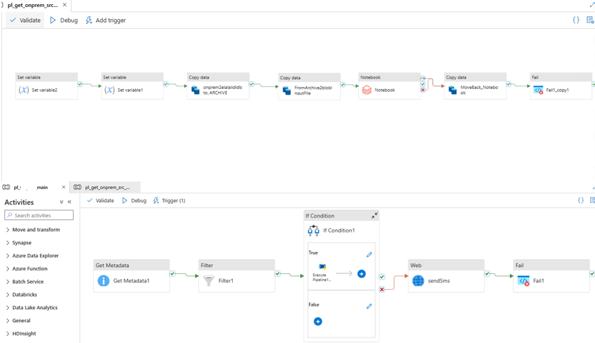
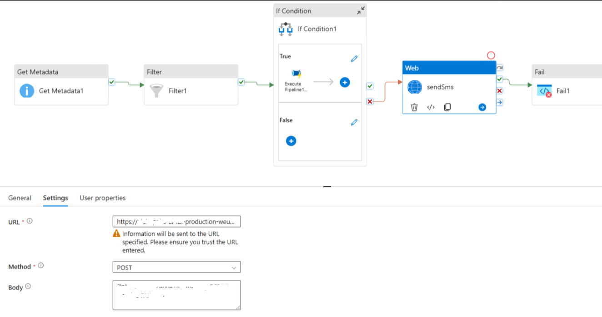
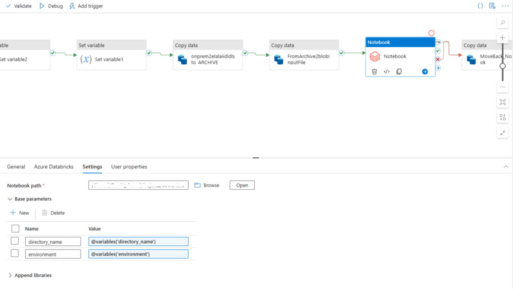

# Azure Data Factory – Development

This document describes the **Azure Data Factory (ADF) development approach**
used in the Enterprise Document Intelligence Platform.

The focus is on **orchestration patterns, integration design, and operational
reliability**, rather than on end-to-end business logic or environment-specific details.

---

## Role of ADF in the Platform
Azure Data Factory serves as the **orchestration layer** of the platform.

Its responsibilities include:
- Coordinating document processing stages
- Triggering external services and compute engines
- Managing control flow, retries, and dependencies
- Emitting execution status and monitoring signals

ADF does **not** perform heavy data processing or business logic.
Those responsibilities are delegated to downstream components
(e.g., Databricks, AI services, Azure Functions).

---

## Pipeline Design Principles

### Parameterized Pipelines
- Pipelines are designed to be reusable and parameter-driven
- Runtime behavior is controlled via parameters and metadata
- Environment-specific values are externalized

This enables the same pipeline structure to support
multiple document types and environments.

---

### Separation of Concerns
- Orchestration logic remains in ADF
- Processing logic is executed in external services
- No complex transformations are embedded in ADF activities

ADF acts as the **conductor**, not the processor.

---

## Activity Patterns Used

ADF pipelines are composed using a small set of
well-defined activity patterns:

- **Web Activities**  
  Used to invoke external APIs (e.g., Document Intelligence, OpenAI).
 
- **Databricks Notebook Activities**  
  Trigger Spark-based processing and enrichment logic.

- **Azure Function Activities**  
  Used for tasks not natively supported by ADF
  (e.g., sending notifications, custom integrations).

- **Copy Activities**  
  Used for controlled data movement when required.

- **Control Flow Activities**  
  If Condition, Until, and ForEach are used to manage
  branching, looping, and conditional execution.

Activities are composed to form clear, readable orchestration flows.

---

## Error Handling & Control Flow
Error handling is designed explicitly and consistently.

Patterns include:
- Dedicated failure paths using *On Failure* dependencies
- Configured retry policies for transient failures
- Timeouts defined per activity type
- Centralized status updates for failed executions

Failures are surfaced clearly and are never silently ignored.

---

## Integration with External Components
ADF integrates with multiple platform components, including:
- Databricks for scalable data processing
- Azure AI services for document extraction
- Azure Functions for custom logic and notifications
- Storage services for document lifecycle management

Each integration is handled through a dedicated activity
and abstracted behind parameters and linked services.

---

## Monitoring & Operational Visibility
ADF development is aligned with operational monitoring needs.

- Each pipeline execution emits status information
- Activity-level success and failure are tracked
- Failures can trigger alerts and downstream actions
- Execution context is propagated to monitoring tables

ADF’s built-in monitoring is complemented by
external logging and alerting mechanisms.

---

## What Is Intentionally Abstracted
To keep this repository **company-agnostic and public-safe**,
the following details are intentionally omitted:
- Exact pipeline sequences
- Business-specific rules
- Environment identifiers
- Real endpoints, credentials, or data structures

The documentation focuses on **design patterns and engineering decisions**,
not on exposing internal implementations.

---

## Summary
The ADF development approach emphasizes:
- Clear orchestration responsibilities
- Reusable, parameter-driven pipelines
- Explicit error handling
- Clean integration boundaries
- Operational transparency

This enables reliable coordination of complex,
document-driven workflows in enterprise environments.
