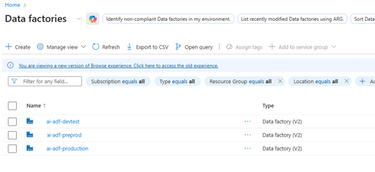
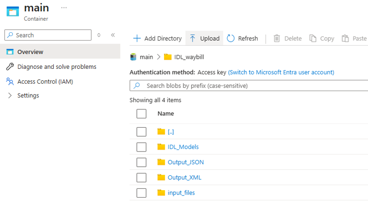
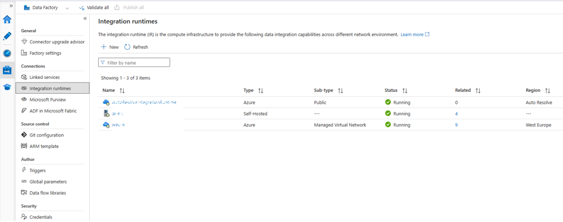
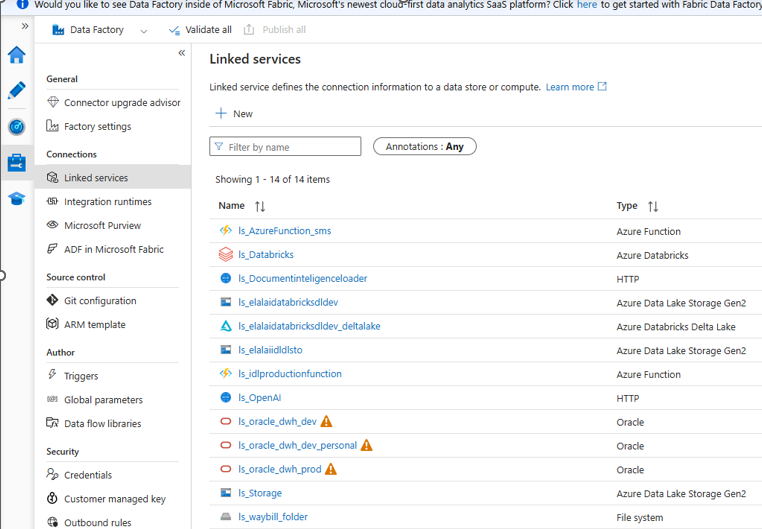
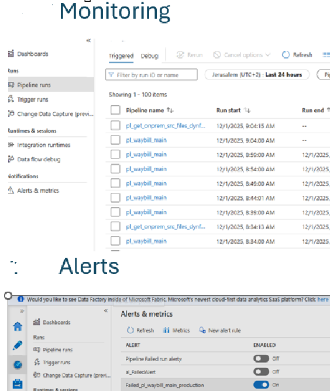

# Azure Data Factory – Infrastructure Overview

This document provides a high-level overview of the **Azure Data Factory (ADF) infrastructure**
used within the Enterprise Document Intelligence Platform.

The focus is on **environment structure, core components, and integration patterns**,
rather than on full pipeline logic or sensitive configuration details.

All descriptions are intentionally generic and sanitized.

---

## Environment Structure

The ADF infrastructure is deployed across multiple environments,
aligned with standard SDLC practices:

- **Development (DEV)** – active development and early testing  
- **Testing / Pre-Production (TEST)** – validation and controlled testing  
- **Production (PROD)** – stable runtime environment  

Each environment contains a dedicated ADF instance
with environment-specific configuration and access control.

### Screenshot – ADF Instances per Environment
Add one screenshot showing multiple ADF instances
(DEV / TEST / PROD), without subscription or tenant details.

## Core Infrastructure Components

### Azure Data Factory

- Separate ADF instance per environment
- Consistent naming conventions
- Authentication based on **Managed Identity**
- Environment-specific parameters and configuration

---

### Storage Accounts

Storage accounts are used for source files, intermediate results,
and final outputs across the platform.

**Logical container separation:**
- `landing`
- `raw`
- `processed`
- `archive`

Access to storage resources is controlled via **RBAC**.

#### Screenshot – Storage Structure
Add one screenshot showing the container structure only  
(no file names or actual data).

### Integration with Databricks

- Dedicated Linked Service per environment
- Secure authentication using **Access Tokens** or **Managed Identity**
- Databricks notebooks used for data processing and enrichment
- Clear separation between orchestration (**ADF**) and processing (**Databricks**)

---

### Integration with AI Services

ADF integrates with external AI services, including:
- **Azure AI Document Intelligence** for OCR and structured extraction
- **Azure OpenAI / GenAI services** for text processing and translation

Results are persisted to storage and downstream tables
for further processing and monitoring.

---

### Integration Runtime

Two integration runtime models are supported:

#### Azure Integration Runtime
- Used for cloud-native data movement
- Default runtime for most pipelines

#### Self-Hosted Integration Runtime
- Used for on-premise or restricted network access
- Secure communication with internal systems
- Runtime health and availability monitored centrally

### Linked Services & Datasets

ADF Linked Services are defined for:
- Storage accounts
- Databricks workspaces
- AI services
- Databases (e.g. monitoring and metadata tables)

Datasets abstract file formats and table structures,
including:
- JSON
- XML
- CSV
- PDF
- SQL-based sources

---

### Pipelines (High-Level)

Pipelines are designed following modular,
production-oriented patterns.

Typical pipeline responsibilities include:
- File intake and registration
- AI-based document processing
- Databricks-based transformation
- Translation and enrichment
- XML generation and file archiving

Pipeline logic is parameterized
and environment-aware.

### Triggers

The solution supports multiple trigger types:
- **Schedule triggers** for time-based execution
- **Event triggers** for file arrival-based processing

Triggers are environment-specific
and managed as part of controlled releases.

---

### Monitoring & Alerts

Monitoring is implemented across multiple layers:
- **ADF Monitor** for pipeline execution status
- SQL-based monitoring tables tracking file lifecycle stages
- Integration Runtime health monitoring
- **Azure Monitor** alerts for failures and anomalies

This enables operational visibility
and faster incident response.

#### Screenshot – Monitoring & Alerts
Add one screenshot showing failed and successful runs  
(no pipeline names or sensitive details).

### Supporting Components

Additional supporting components include:
- **Azure Functions** for actions not natively supported by ADF  
  (e.g. external notifications)
- **Application Insights** for telemetry and diagnostics
- Centralized alerting to email or collaboration tools

---

### Summary

The ADF infrastructure provides:
- Clear separation between environments
- Secure, managed integration patterns
- Scalable orchestration for document processing workflows
- Strong observability and operational control

This foundation enables reliable,
enterprise-grade data and AI pipelines.
