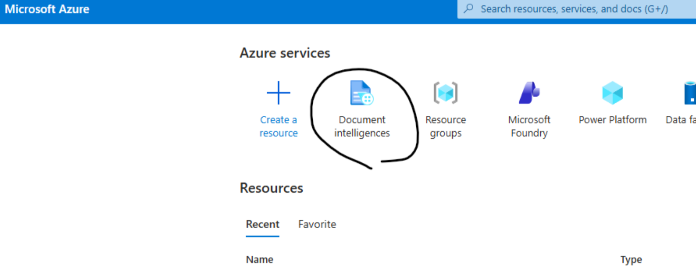
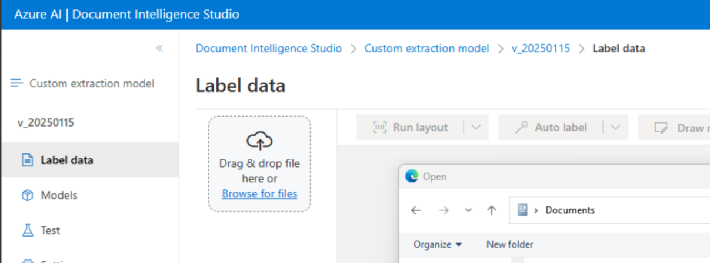
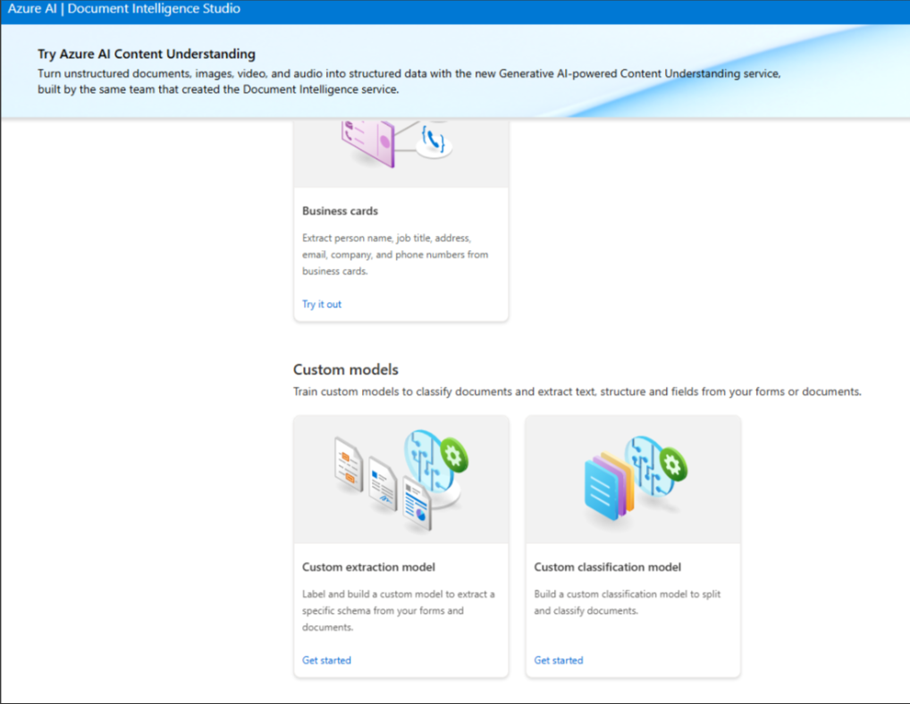
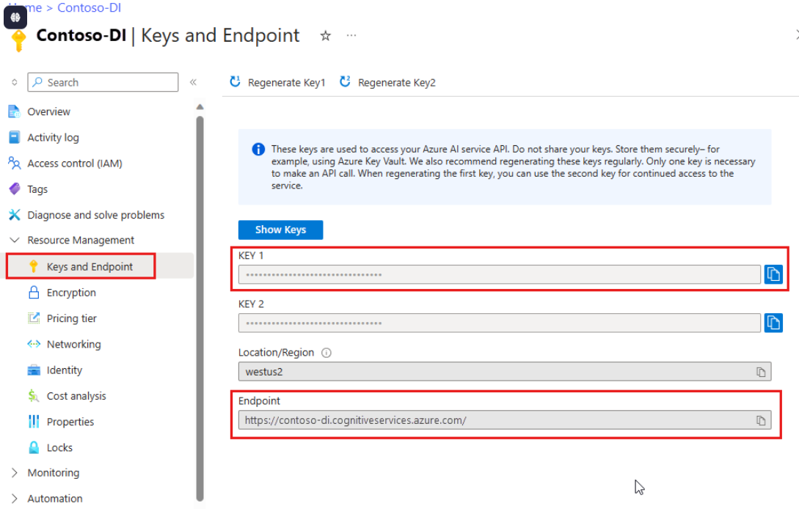
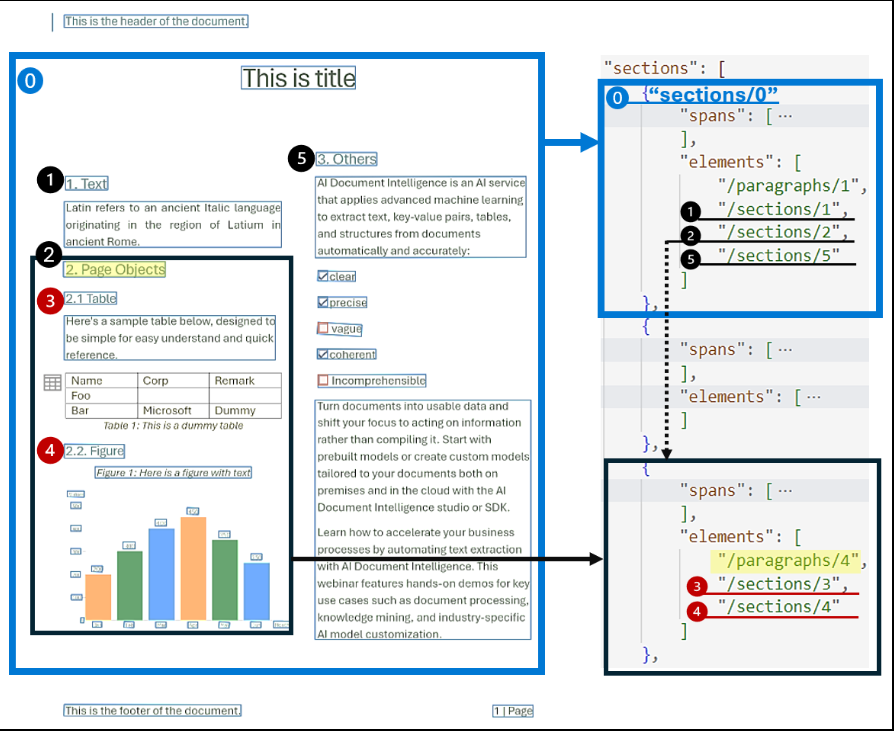
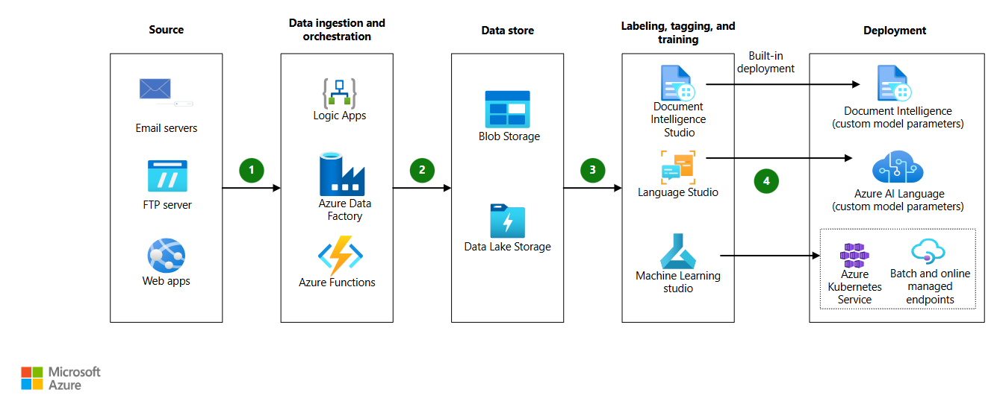

# 📄 Azure Document Intelligence

This module describes how document intelligence models are created and consumed
within the Enterprise Document Intelligence Platform.

The focus is on:
- Model creation in Azure Portal
- API-based consumption from Databricks
- Secure, production-oriented integration patterns

---

## 🧠 Model Creation in Azure Portal

Document Intelligence models are created and managed using the Azure Portal.
The following steps outline the standard workflow used in this platform.

### 1️⃣ Create or Select a Document Intelligence Resource

Navigate to the Azure Portal and open the **Document Intelligence** resource
(previously known as Form Recognizer).




---

### 2️⃣ Create a Custom Model (Document Analysis)

From the resource menu:
- Select **Models**
- Click **Create model**
- Choose **Custom extraction model**
- Upload sample documents for training




---

### 3️⃣ Train & Publish the Model

After labeling (if required) and training:
- Validate extracted fields
- Publish the model
- Copy the **Model ID** for API usage




> 📌 The published Model ID is later injected into Databricks jobs via configuration tables.

---

## 🔗 Consuming the Model from Databricks

Document analysis is performed programmatically from Databricks using
Azure Document Intelligence REST APIs.

The integration is:
- Fully API-based
- Config-driven (no hardcoded secrets)
- Environment-aware (DEV / TEST / PROD)

---

## 🧩 Example: Databricks API Integration (Python)

Below is a simplified example showing how Databricks connects to
Azure Document Intelligence to analyze a document using a custom model.

```python
import requests
import time

endpoint = dbutils.secrets.get("kv-scope", "di-endpoint")
api_key = dbutils.secrets.get("kv-scope", "di-api-key")
model_id = "your-model-id"

analyze_url = f"{endpoint}/documentintelligence/documentModels/{model_id}:analyze?api-version=2023-07-31"

headers = {
    "Ocp-Apim-Subscription-Key": api_key,
    "Content-Type": "application/pdf"
}

with open("/dbfs/mnt/input/sample.pdf", "rb") as f:
    response = requests.post(analyze_url, headers=headers, data=f)

operation_location = response.headers["Operation-Location"]

# Poll for result
while True:
    result = requests.get(operation_location, headers={
        "Ocp-Apim-Subscription-Key": api_key
    }).json()
    if result["status"] in ["succeeded", "failed"]:
        break
    time.sleep(2)

analyze_result = result["analyzeResult"]

------------------

import requests, json, time, base64, os
import urllib.parse

def analyze_document_url_documentintelligence(fileurl,params,url):
    #url = params['endpoint_idl'] + 'documentintelligence/documentModels/'+params['model_idl']+':analyze?api-version='+params['version_idl']
    print(url)
    headers = {
        'Content-Type': 'application/json',
        'Ocp-Apim-Subscription-Key': params['api_key_idl']
    } 
    data = '{"urlSource": "%s" }' % fileurl
    print (data)
    response = requests.post(url, headers=headers, data=data)
    print (response)
    return response.headers['Operation-Location']

def get_aadi_results(url,params):
    headers = {
        'Content-Type': 'application/json',
        'Ocp-Apim-Subscription-Key': params['api_key_idl']
    }
    try_again = True
    while True:
        response = requests.get(url, headers=headers)
        if response.status_code > 299:
            return

        json_response = json.loads(response.content)
        if json_response["status"] == "succeeded":
            return json_response["analyzeResult"]
        elif json_response["status"] == "running":
            time.sleep(.5)
        else:
            return
			
```			
			
			
