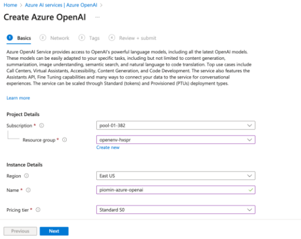
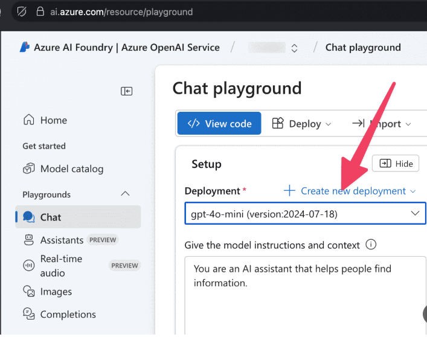

## GenAI Processing

GenAI capabilities are used as a **post-extraction enrichment layer**
within the document processing pipeline.

The integration is based on **Azure OpenAI**
and is intentionally scoped to text-level processing only.

---

### Role of GenAI in the Platform

GenAI is applied after structured data has been extracted
by Document Intelligence services.

Typical responsibilities include:
- Post-extraction enrichment using Large Language Models (LLMs)
- Context-aware validation of free-text fields
- Free-text normalization and interpretation
- Language translation and text refinement
- Controlled integration with enterprise data flows

GenAI does **not** perform authoritative decisions
and does **not** replace deterministic business logic.

---

### GenAI Service Used – Azure OpenAI

The platform integrates with **Azure OpenAI**
as the managed GenAI service provider.

Azure OpenAI enables:
- Enterprise-grade security and governance
- Controlled model deployment
- Secure API-based invocation from processing layers
- Alignment with organizational compliance requirements

### Integration Characteristics

- GenAI calls are invoked programmatically from the processing layer
- Prompt construction and response handling are controlled and auditable
- Results are persisted to storage or downstream tables
- Outputs are treated as **enriched data**, not as a system of record

This ensures safe and predictable usage of GenAI
within enterprise document workflows.

---

### Summary

GenAI processing enhances document workflows
by enabling flexible and intelligent text handling,
while maintaining strict boundaries around:
- Decision-making
- Data ownership
- Security and governance

