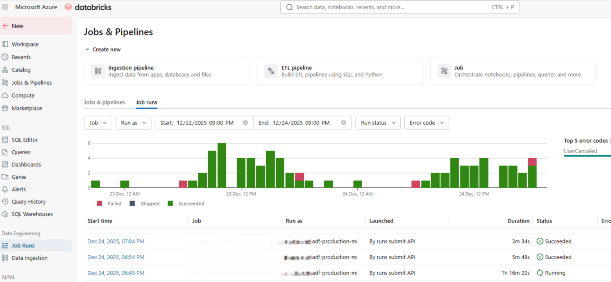
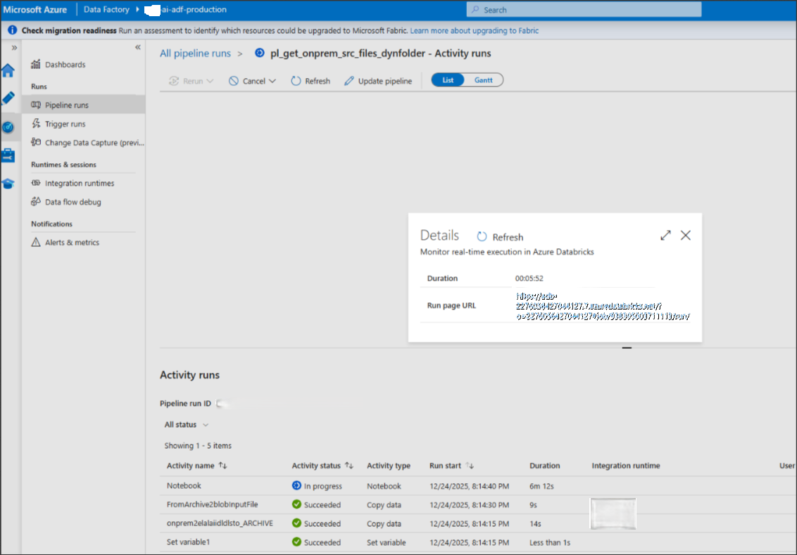
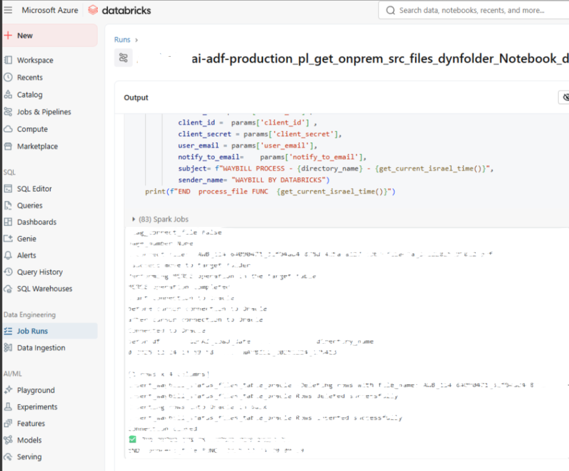
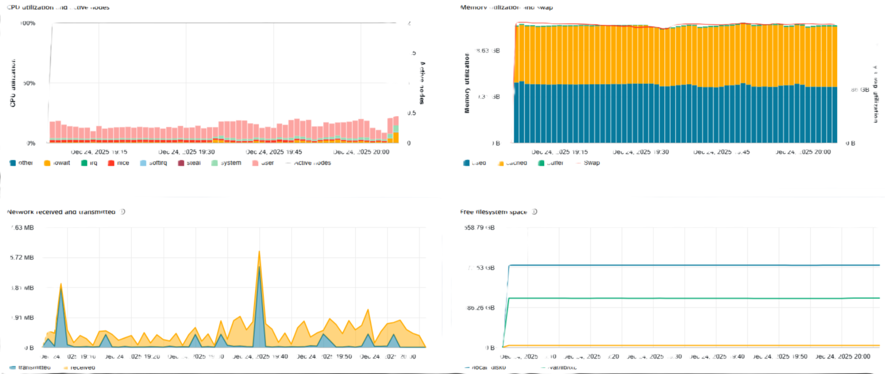

# Databricks Development

This document describes the **Databricks development approach** used in the
Enterprise Document Intelligence Platform.

The focus is on **production-oriented patterns**, reliability, and maintainability,
rather than on Spark or Python fundamentals.

---

## Role of Databricks in the Platform
Databricks serves as the **processing and transformation layer** of the platform.

Its responsibilities include:
- Validation of extracted document data
- Data transformation and normalization
- Enrichment and business logic application
- Structured persistence to downstream tables
- Centralized logging and metrics emission

Databricks is intentionally decoupled from orchestration, which is handled by Azure Data Factory (ADF).

---

## Development Principles

### 1. Clear Separation of Concerns
- ADF handles orchestration, retries, and dependencies
- Databricks focuses solely on data processing logic
- No orchestration logic embedded in notebooks

---

### 2. Idempotent Processing
Processing logic is designed to be **safe to re-run**:
- Deterministic keys per document
- Merge / upsert patterns instead of blind inserts
- Explicit handling of duplicates and reprocessing scenarios

This enables reliable retries and recovery from partial failures.

---

### 3. Config-Driven Logic
- Runtime behavior is controlled via configuration inputs
- No hardcoded environment-specific values
- Parameters define:
  - Input locations
  - Target tables
  - Processing modes
  - Validation rules

This supports reuse across document types and environments.

---

## Notebook Structure & Organization
Notebooks follow a consistent and readable structure:

1. Configuration and parameter loading  
2. Input validation and schema enforcement  
3. Core transformation logic  
4. Enrichment and business rules  
5. Write to target tables  
6. Logging and metrics  

Non-trivial logic is isolated into reusable functions.

---

## Schema Management & Validation
- Explicit schema definitions are preferred
- Incoming data is validated against expected structure
- Invalid or incomplete records are:
  - Logged with error context
  - Routed to error handling paths
  - Excluded from final writes when required

Schema drift is detected and handled deliberately.

---

## Data Storage Patterns
- Delta Lake tables are used for persistence
- Merge-based writes ensure consistency
- Partitioning strategies align with access patterns
- Table design supports downstream reporting and analytics

---

## Error Handling Strategy
Databricks handles **data-level and logic-level errors**, while orchestration errors are handled upstream.

Patterns include:
- Try/except blocks around critical transformations
- Explicit error categories
- Structured error records written to logging tables
- Clear failure signaling back to ADF when required

Silent failures are explicitly avoided.

---

## Logging & Observability
Each execution emits:
- Processing status (success / failure)
- Record counts (processed, rejected)
- Execution timestamps
- Error summaries when applicable

Logs are structured and designed for downstream monitoring and auditing.

---

## Performance Considerations
- Transformations are designed to minimize shuffles
- Joins are reviewed for cardinality and broadcast suitability
- Caching is used selectively
- Large datasets are processed incrementally when possible

Performance optimizations are driven by observed metrics, not assumptions.

---

## Testing & Validation
- Logic is validated on representative sample datasets
- Edge cases (missing fields, invalid formats) are explicitly tested
- End-to-end validation is performed after integration with ADF

---

## Python & Spark – Focused Development Notes

The Databricks development layer relies on a focused subset of
Python and Spark capabilities that are relevant for
enterprise-scale, production-grade data processing.

To avoid duplicating generic documentation, detailed notes are maintained separately:

- 📘 **Python Development Notes**  
  Patterns used for configuration-driven logic, error handling,
  logging, and reusable utilities:  
  👉 [python-notes.md](python-notes.md)

- ⚡ **Spark Development Notes**  
  Schema enforcement, Delta Lake usage, merge patterns,
  partitioning considerations, and performance awareness:  
  👉 [spark-notes.md](spark-notes.md)

These documents complement this development guide
and provide deeper technical context where required.

---

## Summary
The Databricks development approach emphasizes:
- Reliability over quick prototypes
- Clear ownership boundaries
- Observability and auditability
- Reusability of proven engineering patterns

This enables scalable and maintainable document intelligence solutions
in enterprise environments.
