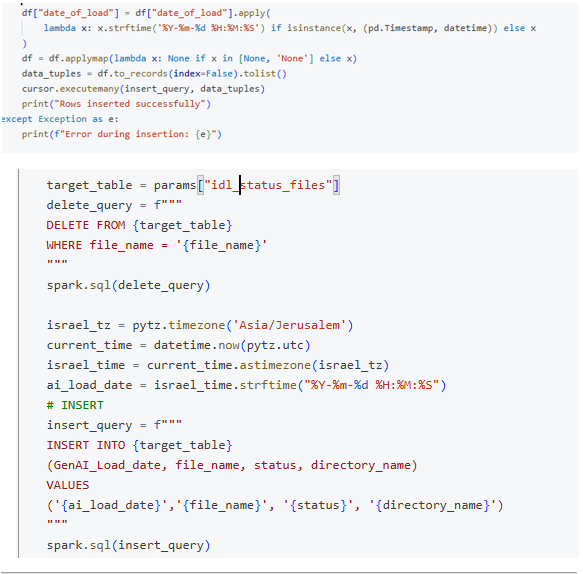

# Spark Development Notes (PySpark)

This document summarizes **practical Spark and PySpark usage**
as applied within Databricks-based, enterprise data processing workflows.

The focus is on **real-world patterns** used for data transformation,
monitoring, and reliability — not on Spark fundamentals.

---

## Scope & Context
Spark is used as the **core processing engine** for:
- Structured and semi-structured data
- Large-scale transformations
- Delta Lake–based persistence
- Operational monitoring flows

All examples and patterns described here are taken from
production-oriented Databricks workflows.

---

## 1. Working with DataFrames & Spark SQL
Daily development combines **PySpark DataFrames and Spark SQL**.

Typical usage patterns:
- DataFrame-based transformations for logic and enrichment
- Spark SQL for readable joins, aggregations, and validations
- Switching between APIs based on clarity and intent, not preference

This hybrid approach improves readability and maintainability.

---

## 2. Delta Lake – MERGE / UPSERT Patterns
Delta Lake is used for **controlled and consistent writes**.

Common patterns include:
- `MERGE` for idempotent writes
- UPSERT logic based on deterministic business keys
- Safe reprocessing of documents and events
- Separation between insert, update, and error paths

These patterns support retries and operational stability.

*(Screenshot examples can be added here)*

---

## 3. Use of PySpark Functions
Built-in PySpark functions are used extensively for:
- Data normalization
- Type casting and validation
- Conditional logic
- Enrichment and derivations

Preference is given to native Spark functions over UDFs
for performance and clarity.

---

## 4. Configuration-Driven Processing
Processing behavior is driven by **configuration tables** stored in Delta.

Typical configuration use cases:
- Source definitions
- Target table mapping
- Processing flags
- Validation rules

This enables flexible behavior without code changes
and supports reuse across document types and environments.

*(Screenshot examples can be added here)*

---

## 5. Monitoring & Control Tables (Delta-Based)
Delta tables are used to implement **monitoring and control flows**.

Patterns include:
- Inserting execution records at process start
- Updating status during processing
- Merging final results and error states
- Capturing execution metadata (timestamps, counts, status)

This creates an auditable execution trail per run.

---

## 6. Notebooks as Workflow Units
Databricks Notebooks are treated as **logical processing units**:
- Clear input and output boundaries
- Explicit parameters
- No embedded orchestration logic
- Designed to be triggered by Databricks Jobs or external orchestrators

Notebooks focus on **processing**, not scheduling.

---

## 7. Working with Data Lake Files
Spark is used to:
- Read files from Data Lake storage
- Handle multiple formats (e.g. JSON, CSV, Parquet)
- Normalize raw inputs
- Persist structured results into Delta tables

File handling logic is isolated and reusable.

---

## Summary
Spark capabilities demonstrated in this context include:
- Spark SQL usage
- DataFrame-based processing
- Delta Lake MERGE / UPSERT
- Configuration-driven logic
- Execution monitoring via Delta tables
- Databricks Notebook–based workflows
- File-based ingestion from Data Lake

These patterns support **scalable, reliable, and maintainable**
enterprise data processing solutions.

