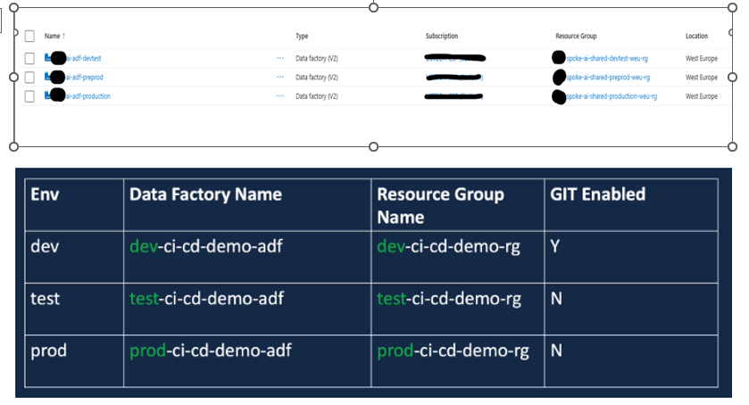
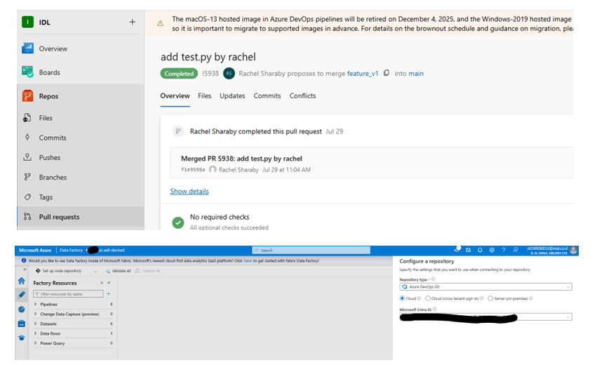

# CI/CD for Azure Data Factory  
**Option 1 – Pre & Post Deployment Tasks**  
**DEV → TEST → PROD**

---

## 1. Introduction
This document describes the CI/CD methodology implemented for **Azure Data Factory (ADF)**,
based on Microsoft’s official recommended approach:

**Option 1 – Pre and Post Deployment with PowerShell Scripts**

The document covers:
- Environment architecture (3 environments – DEV, TEST, PROD)
- Git integration limited to the DEV environment
- Use of ARM Templates for cross-environment deployments
- Full CI/CD pipeline implemented in Azure DevOps
- Pre-Deployment Script
- Post-Deployment Script
- Release process for TEST and PROD environments

---

## 2. Environment Architecture
Three isolated environments were established, each deployed in a separate Resource Group:

- **RG-DEV**
- **RG-TEST**
- **RG-PROD**

Only the **DEV** environment is connected to Git (Azure DevOps Repository).  
The **TEST** and **PROD** environments are not Git-connected; updates are applied
exclusively through the Release Pipeline.

### 

---

## 3. DEV Environment – Git Enabled
All development activities take place in the DEV environment:

- Git integration enabled
- Development performed using Feature Branches (if applicable)
- At the end of development, a **Publish** action is triggered
- The Publish action automatically generates:


```text
/factory        → ADF configurations (pipelines, datasets, linked services, etc.)
/arm_template   → template.json + parameters.json

```
### 

## 4. CI/CD Process Overview

### Continuous Integration (CI)
After publishing from the DEV environment, ARM templates are generated.

The CI pipeline performs the following steps:
- Template validation
- Artifact build
- Publishing the artifact to Azure DevOps

---

### Continuous Delivery (CD)
The release process consists of two stages:
1. Deployment to **TEST**
2. Deployment to **PROD**

Both stages are based on:
- ARM Template (`template.json`)
- ARM Parameters
- Pre-deployment PowerShell script
- ARM Deployment
- Post-deployment PowerShell script

## 5. Pre-Deployment & Post-Deployment Scripts (Option 1)

The process is based on the official Microsoft example:  
https://learn.microsoft.com/en-us/azure/data-factory/continuous-integration-delivery-sample-script  
(`PrePostDeploymentScript.Ver2`)

### Pre-Deployment Script
Executed before the ARM deployment and performs the following actions:
- Disconnects Git (FactoryVCS) from non-DEV environments
- Updates dynamic parameters
- Replaces environment-specific values  
  (connection strings / Key Vault references)
- Validates ARM templates

This approach is typical in enterprise environments.

### Post-Deployment Script
Executed after the ARM deployment:
- Starts or stops triggers as required
- Verifies Integration Runtime (IR) availability
- Validates successful deployment
- Performs cleanup and restores resources to an operational state
## 6. Release Pipeline – Full Flow

### Stage 1: TEST
- Download artifact from the CI pipeline
- Pre-Deployment Script
- ARM Deployment
- Post-Deployment Script
- Trigger activation

### Stage 2: PROD
- Same process as TEST
- **Manual Approval** is recommended before deployment

## 7. ARM Template Structure
Publishing from the DEV environment generates the following structure:

```text
/arm_template
  ├── template.json
  └── parameters.json
```
The templates include:
Pipelines
Dataflows
Datasets
Linked Services
Global Parameters
Triggers
Integration Runtime configuration

Deployments are executed using Incremental mode.


## 8. Repository Structure
After publishing from Azure Data Factory:
```text
/factory
  ├── pipelines/
  ├── dataflows/
  ├── datasets/
  ├── linkedServices/
  └── globalParameters.json

/arm_template
  ├── template.json
  └── parameters.json
```
## 9. End-to-End Process Summary

1. Development in the **DEV** environment (Git connected)
2. Publish → ARM Templates generation
3. CI Pipeline:
   - Validate
   - Build
   - Publish Artifact
4. Release Pipeline:
   - Deploy to **TEST**
   - Deploy to **PROD**
5. Deployment to **PROD** occurs only after approval (if configured)

## 10. Summary

This document describes a complete CI/CD process for Azure Data Factory using  
**Option 1 – Pre & Post Deployment Scripts**, including environment architecture,
development workflow, a full CI/CD implementation, ARM templates,
and supporting deployment scripts.
